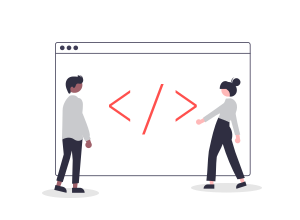

    

        <a href="articles/getting-started/installation.html" class="card-link">
            
            <h3>Installation</h3>
            
Learn how to add the Radzen.Blazor Nuget package to your application.

        </a>
    

    

        <a href="articles/getting-started/use-component.html" class="card-link">
            
            <h3>Using a component</h3>
            
Add a Radzen Blazor component to a page, set its properties and handle its events.

        </a>
    

    

        <a href="api/index.html" class="card-link">
            
            <h3>API Reference</h3>
            
Explore the Radzen Blazor Components API Reference.

        </a>
    

    <h2 class="subtitle">Radzen Support Options</h2>
    

        
        <h3>Community support</h3>
        
Everybody is welcome to visit the <a href="https://forum.radzen.com" target="_blank">Radzen Community forum</a>. Join the growing community and participate in the discussions!

        
The Radzen team monitors the forum threads but does not guarantee a response to every question.

    

    

        
        <h3>Dedicated Support</h3>
        
Radzen offers dedicated support with the Radzen Professional and Enterprise subscriptions.

        
A Radzen subscription provides:

        <ul class="text-left">
            <li>Dedicated support over email with guaranteed response time (24 hours for Radzen Professional and 16 hours for Radzen Enterprise).</li>
            <li>Full access to <a href="https://www.radzen.com/" target="_blank">Radzen</a> - the first WYSIWYG Blazor development environment on the market.</li>
            <li><a href="https://www.radzen.com/documentation/premium-themes/" target="_blank">Premium themes</a> and visual <a href="https://www.radzen.com/documentation/theme-customization/" target="_blank">theme customization</a>.</li>
            <li>Complete Blazor application scaffolding from the most commonly used databases - MSSQL, Oracle, MySQL and PostgreSQL.</li>
            <li>Built-in deploy to IIS, FTP, Zip and Azure.</li>
            <li>Multi-tenancy support</li>
        </ul>
    

